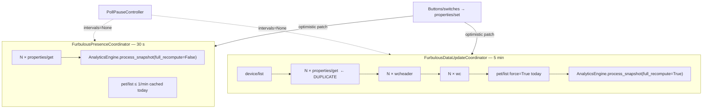
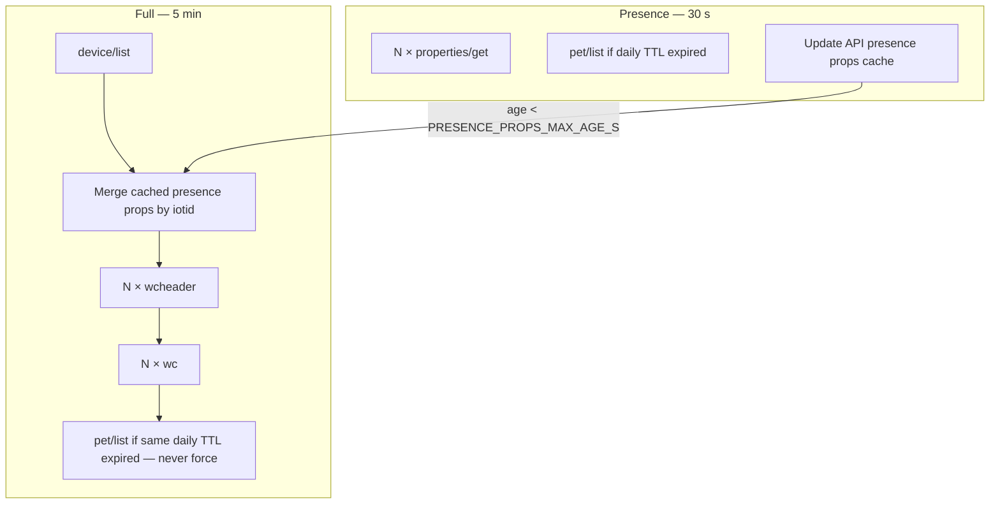
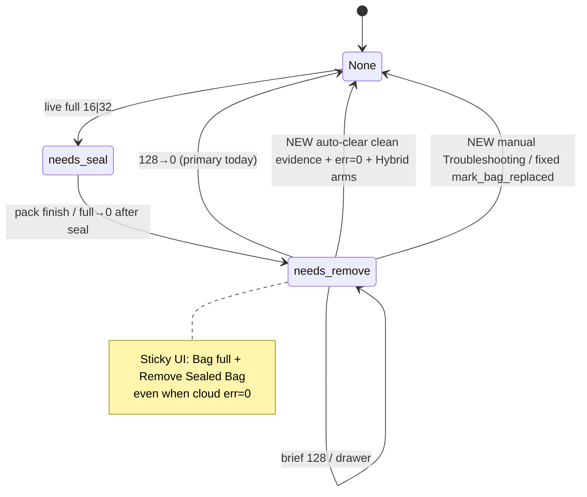
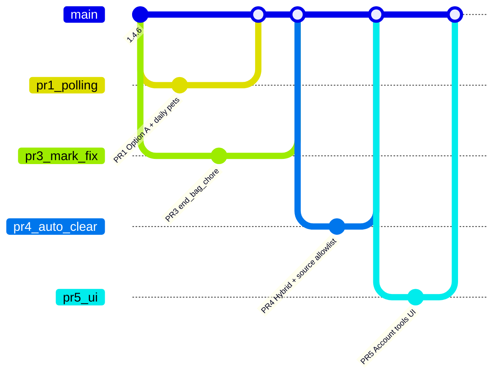

# Design: Polling efficiency + Troubleshooting clear-alerts (sticky bag chore)

| Field | Value |
|-------|--------|
| **Date** | 2026-08-28 |
| **Status** | Approved; Open Questions resolved — ready for implementation PRs |
| **Revision** | 2026-08-28r5 (pet/list ≤1/day; Q1–Q4 locked; Empty record_replaced=False) |
| **Target codebase** | `/Users/steve/furbulous` (integration `1.4.6`) |
| **Prior review** | [`docs/reviews/2026-08-25-api-polling-efficiency-review.md`](../reviews/2026-08-25-api-polling-efficiency-review.md) |
| **Audience** | Implementers + reviewers |
| **Parts** | **A** — API polling efficiency · **B** — Troubleshooting clear-alerts + sticky bag chore |

---

## Overview

This document covers two tightly coupled workstreams for the Furbulous Home Assistant integration:

- **Part A** cuts duplicate cloud `properties/get` traffic so each device stays at **≤2 polls/min**, matching the field hypothesis that excess API calls interrupt boxes (pause restores normal behavior).
- **Part B** adds an intentional HA-only Troubleshooting escape hatch for sticky bag/error alerts, fixes `mark_bag_replaced` so it clears sticky `bag_chore`, and **requires** auto-clear of `needs_remove` when clean evidence arrives under cloud `err=0` — with explicit guards against morning scheduled scoops falsely clearing an overnight sticky chore.

**Cross-cutting constraint:** Part A’s locked **30 s** presence cadence is required for Part B reliability. Cleo captures show No Bag (**128**) can last **~20 s**; a slower live poll would routinely miss **128→0** and leave sticky Remove Sealed Bag until manual clear or the new clean-evidence path.

---

## Background & Motivation

### Field signal (polling)

Operators report boxes misbehave while HA is actively polling the cloud and behave normally when cloud polling is paused (`PollPauseController` in `poll_pause.py` nulls both coordinator intervals). Vendor behavior is known to be **single active session / sensitive to concurrent control**. Causation is not proven in code; call volume is measurable and actionable.

### Sticky bag chore gap (alerts)

Since **1.4.5**, HA maintains sticky `bag_chore` (`needs_seal` → `needs_remove`) because cloud `errorReportEvent` alone is insufficient after Seal: full bits (**16|32**) often clear to **0** while the sealed bag still sits in the drawer (`bag_chore.py`, Cleo capture). Primary clear today is **128→0** in `AnalyticsEngine._process_device` (`analytics/engine.py`).

Observed failure modes:

1. **Missed brief 128** → sticky **Remove Sealed Bag** / Bag full UI remains forever (or until reload luck — chore flags are process-local).
2. **`mark_bag_replaced` does not clear `bag_chore`** — service/button path resets Bag age via `_record_bag_replaced` but leaves `st["bag_chore"]` set (`mark_bag_replaced` ~L1095–1118; `_record_bag_replaced` ~L950–989 never clears chore). Tests assert only `last_bag_ts` (`test_mark_bag_replaced_service_path`).
3. **Cousin path:** `record_hand_mode(HAND_MODE_EMPTY)` also calls `_record_bag_replaced` (~L1179) without clearing `bag_chore` / `saw_no_bag_during_remove` — same sticky class as (2).
4. **No safe dashboard escape hatch** for “HA still red, box is fine” without digging into developer services.
5. **Naive auto-clear on any clean + err=0** would dismiss real overnight sticky chores when the **07:00 / 07:05** double morning scoop runs with cloud already at **0** after seal (sealed bag still present).

---

## Goals & Non-Goals

### Goals

| ID | Goal |
|----|------|
| G-A1 | Cap live `properties/get` at **exactly 2/min/device** (30 s presence). |
| G-A2 | Full 5-min poll **must not** call `properties/get` again; reuse presence snapshot (Option A / R1). |
| G-A3 | Preserve immediate control writes; UI confirm on next ~30 s poll (optimistic patch already in `helpers.apply_write_to_runtime`). |
| G-A4 | Quantify before/after HTTP for the **4-box** house; document fast vs slow paths. |
| G-B1 | Dashboard bottom **Account tools** stack: Pause first, then visible per-device Clear alerts (HA-only); not mixed into Clean/Seal rows. |
| G-B2 | Clear sticky bag/error alerts with **gate/warn** when cloud still has live full (**16\|32**) or live No Bag (**128**). |
| G-B3 | Keep **Mark cleaned** separate (Dirty only) — must **never** clear `bag_chore`. |
| G-B4 | `mark_bag_replaced` **must** clear `bag_chore` sticky state. |
| G-B5 | **Auto-clear** sticky `needs_remove` via solid clean evidence when cloud `err=0` (not full, not 128), with morning-scoop guards. |
| G-B6 | Primary clear remains observed **128→0**; Troubleshooting is escape hatch when 128 was missed. |

### Non-Goals

| ID | Non-goal |
|----|----------|
| NG1 | Adaptive / idle-slow polling (Option C) — deferred. |
| NG2 | Parallel slow-path GETs (Option E) — deferred (may worsen interruption hypothesis). |
| NG3 | Putting WC / wcheader on the 30 s path. |
| NG4 | Cloud writes from Troubleshooting clear (no `properties/set` to force err=0). |
| NG5 | Silently clearing alerts while cloud still reports live full or live 128. |
| NG6 | Merging Mark cleaned into bag-alert clear. |
| NG7 | Changing Dirty / Last cleaned evidence rules from 1.4.6 (reuse them; do not redefine). |
| NG8 | Proving vendor interruption causation — only reduce load + add diagnostics later if chosen. |
| NG9 | Inventing a per-minute props budget counter for full-poll stale fallback (v1 skips GET + logs). |

---

# Part A — API polling efficiency

## Current architecture



**Key files**

| Component | Path | Role |
|-----------|------|------|
| Presence coordinator | `custom_components/furbulous/coordinator.py` — `FurbulousPresenceCoordinator` | 30 s live edges |
| Full coordinator | same — `FurbulousDataUpdateCoordinator` | 5 min list/stats/WC |
| API snapshots | `furbulous_api.py` — `async_get_presence_snapshot`, `async_get_full_snapshot` | HTTP fan-out |
| Intervals | `const.py` — `UPDATE_INTERVAL_FAST_SECONDS=30`, `UPDATE_INTERVAL_NORMAL_MINUTES=5`, `PET_LIST_MIN_INTERVAL_SECONDS=60` (**today**; target **86400** / daily) | Budgets |
| Pause | `poll_pause.py` — `PollPauseController` | Stops both; resume refreshes presence then full |
| Optimistic writes | `helpers.py` — `apply_write_to_runtime` | No immediate GET after set |

### Current HTTP math (idle, happy path, no retries)

Let \(N\) = number of boxes. Formulas from the 2026-08-25 review (validated against `async_get_*_snapshot`):

| Path | Per tick |
|------|----------|
| Presence (every 30 s) | \(N\) × `properties/get` + `pet/list` at most every **60 s** (today: `PET_LIST_MIN_INTERVAL_SECONDS=60`, `get_pets(force=False)`) |
| Full (every 5 min) | 1 × `device/list` + \(N\) × (`properties/get` + `wcheader` + `wc`) + 1 × `pet/list` **`force=True`** (today) |

**Idle HTTP/hour ≈ \(72 + 12 + 156N\)** with current code, where **72** = pet/list (~60/h presence-capped + 12/h forced full), **12** = `device/list`, **156N** = 132N props + 24N (wcheader+wc). Validated against `furbulous_api.py` / `const.py`.

| Metric | 1 box | **4 boxes (this house)** |
|--------|------:|-------------------------:|
| HTTP / hour | ~240 | **~708** |
| HTTP / min (avg) | ~4.0 | **~11.8** |
| `properties/get` / min / box | **2.2** | **2.2** |
| `pet/list` / hour (account) | **~72** | **~72** |
| Worst minute (full + presence overlap) | ~8 account calls | **~23**; up to **5 device-scoped GETs/box** that minute |

Presence alone already uses the **entire ≤2/min/device** props budget. The full path’s extra `properties/get` pushes average to **2.2/min** and spikes the overlap minute. Pet roster is account-scoped and changes rarely — today’s ~72 `pet/list`/hour is disproportionate.

### What must stay fast (~30 s)

These justify the live path (`_process_device` on presence only — `detect_edges = not full_recompute`):

- Cat in box / visit start–end → Dirty / awaiting
- Bag full / No Bag / E4 / lid
- Clean / pack cycle in progress
- Sticky bag chore transitions (including brief **128**)
- Control confirmation after user press (optimistic local write; cloud confirm ≤30 s)

**Note:** Live bag/error entities already bind to the **presence** coordinator (`device_entities.py`). Option A therefore does **not** weaken 128→0 / bag edges — those never ran on the full path.

### What can stay slow (minutes)

- Device list membership (`device/list`)
- Pet roster (rarely changes; target **≤1/day** after Q1)
- WC visit history hydration
- wcheader (uses today / vs yesterday)
- Hours-since rollups (mostly local EventStore; full_recompute=True)

## Proposed design (Part A)

### Locked decisions

| Decision | Choice |
|----------|--------|
| Live `properties/get` interval | **30 s** (keep) |
| Full poll duplicate props | **Forbidden** — reuse presence snapshot (Option A / R1) |
| Control writes | **Immediate** `properties/set`; confirm on next ~30 s poll |
| Field hypothesis | Excess calls interrupt devices; pause restores behavior — treat as design constraint |
| Stale cache fallback | **Skip props GET + WARNING**; reuse props from `prior_devices` passed by full coordinator — **no** per-minute budget counter in v1 |

### Target architecture



### Option A cache contract (normative — implementable)

Lock these API details for PR1:

1. **Cache location:** `FurbulousCatAPI` owns `_presence_props_cache: dict[str, PresencePropsCacheEntry]` keyed by `iotid`.

2. **Cache entry shape:**
   ```text
   PresencePropsCacheEntry = {
     "properties": dict,          # same shape as get_device_properties value map
     "property_times": dict,      # may be empty dict
     "mono_ts": float,            # time.monotonic() at successful presence write
     "device_id": Any | None,     # optional convenience
   }
   ```

3. **Publisher:** At the **end** of a successful `async_get_presence_snapshot`, for each device with an `iotid`, overwrite that cache entry with props + property_times + `mono_ts=time.monotonic()`.

4. **Reader signature (locked):**  
   `async def async_get_full_snapshot(self, prior_devices: list[dict[str, Any]] | None = None) -> dict[str, Any]`  
   **Coordinator wiring (locked):** `FurbulousDataUpdateCoordinator._async_update_data` calls  
   `await self.api.async_get_full_snapshot(prior_devices=(self.data or {}).get("devices"))`  
   when `self.data` is a dict (else `prior_devices=None` on first refresh).

   **`async_get_full_snapshot` must not** call `get_device_properties`. For each device from `device/list`:
   - If cache hit and `(now_mono - mono_ts) < PRESENCE_PROPS_MAX_AGE_S` (**90.0** s, constant in `const.py`): merge `properties` / `property_times` onto the device dict; clear any `props_stale`.
   - Else (**missing or stale**): **do not** GET props. Build an index of `prior_devices` by `iotid`. If a prior row exists with a non-empty `properties` map, **reuse** that `properties` / `property_times` onto the new device dict and set `device["props_stale"] = True`. If no usable prior row: set `properties` to `{}` (and empty `property_times`), set `props_stale=True`. Log **WARNING** once per tick summarizing stale/missing iotids (whether reused or empty).
   - Always still fetch `wcheader` + `wc` when `iotid` present.

5. **Pets (Q1 locked — once per day):** Replace today’s 60 s min interval + full-path `force=True` with a **single account-scoped gate**:
   - Constant: `PET_LIST_MIN_INTERVAL_SECONDS = 86400` (or rename to `PET_LIST_MAX_AGE_S = 86400`) — **rolling 24 h from last successful fetch** (`_last_pets_fetch_mono` / wall clock on success). Not calendar midnight.
   - `get_pets(force=False)` on **both** presence and full: fetch only if cache empty / never fetched **or** age ≥ 24 h.
   - Full path must **never** call `get_pets(force=True)` on the 5-min tick.
   - **First poll after load/login:** allowed (no successful fetch yet).
   - **Resume-from-pause:** same TTL — do **not** stampede a fresh `pet/list` just because polling resumed; only fetch if TTL expired or never fetched.
   - Roster for name matching uses last cached pets until the next daily refresh (acceptable — pets change rarely).

6. **Entity impact:** Live alert UI is presence-fed — full-merge staleness affects list/WC/stats and entities that read the **full** coordinator (many switches/buttons use full + `apply_write_to_runtime` which patches **both**). Optimistic writes continue to patch both snapshots; cloud confirm remains the next **presence** tick (~30 s). Full props becoming sparse after long pause is acceptable; entities already tolerate missing keys.

7. **Unit test contract:** With a fresh cache (age &lt; 90 s), a full snapshot must issue **zero** `properties/get` HTTP calls (mock counter). Presence snapshot still issues exactly N.

8. **Rejected for v1:** “One stale-device fetch if under 2/min budget” — requires a minute window counter and races with presence; **NG9**.

### Concrete changes (summary)

| # | Change |
|---|--------|
| 1 | Implement props cache contract in `furbulous_api.py` (`prior_devices` arg) |
| 2 | Coordinator passes `(self.data or {}).get("devices")` into full snapshot |
| 3 | `PRESENCE_PROPS_MAX_AGE_S = 90.0` in `const.py` |
| 4 | Pets: `PET_LIST_MIN_INTERVAL_SECONDS = 86400` (rolling 24 h); never `force=True` on full; presence + full share gate |
| 5 | Resume already awaits presence then full — no props double-fetch after Option A; pets respect same 24 h TTL (no resume stampede) |
| 6 | Update README poll budget numbers |

### After-state math (4 boxes)

Pet/list contribution today ≈ **72/h** (60 presence + 12 forced full). After daily TTL ≈ **1/24 ≈ 0.04/h** (negligible in the hourly formula).

| Scenario | Formula | HTTP / hour (N=4) | props/min/box | pet/list / hour |
|----------|---------|------------------:|--------------:|----------------:|
| **Before (today)** | \(72 + 12 + 156N\) | **708** | 2.2 | ~72 |
| **R1 only** (no full props; pets unchanged) | \(72 + 12 + 144N\) | **660** | **2.0** | ~72 |
| **R1 + old R2** (no forced full pets; presence still ≤1/min) | \(60 + 12 + 144N\) | **648** | **2.0** | ~60 |
| **R1 + daily pets (Q1 — target)** | \(12 + 144N + \frac{1}{24}\) | **~588** | **2.0** | **~0.04** |

Live latency: **30 s unchanged**. WC / stats: **5 min unchanged**. Pet roster freshness: **≤24 h**.

Target for this release: **R1 + daily pet/list → ~588/h** at N=4 (−120 vs today).

### HA coordinator practices (keep / fix)

| Practice | Status after Part A |
|----------|---------------------|
| Cloud I/O only in coordinators | ✅ keep |
| Dual fast/slow coordinators | ✅ fix duplication |
| Entities `CoordinatorEntity`, no self-poll | ✅ keep |
| Shared `aiohttp` session | ✅ keep |
| Optimistic writes without immediate GET | ✅ keep (`helpers.py`) |
| Coalesce / reuse fresh props on slow path | ✅ **add** (cache contract) |
| Bounded parallel multi-device GET | ❌ defer (serial safer under interruption hypothesis) |
| Documented poll budget = reality | ✅ update docs |

### Risks (Part A)

| Risk | Mitigation |
|------|------------|
| Full poll merges **stale** presence props after pause/failure | Age gate; skip GET; reuse `prior_devices` props + WARNING; resume awaits presence first |
| Device rename / membership only on list | Accept 5 min latency for names; list still every full tick |
| Online flag divergence if only on properties | Prefer list fields; document if vendor puts online only on props |
| Implementers re-add props “just to be safe” | Unit test: zero `properties/get` when cache fresh |
| Full coordinator props sparse after long pause | Live UI is presence-fed; write confirm on presence; `props_stale` marker |

---

# Part B — Troubleshooting clear-alerts + sticky bag chore

## Current bag-chore state machine



**Evidence sources**

- Phases / labels: `bag_chore.py` (`CHORE_NEEDS_SEAL`, `CHORE_NEEDS_REMOVE`, `chore_error_label`, `chore_bag_status`)
- Transitions: `analytics/engine.py` `_process_device` (~L796–944), `_record_cloud_pack`, `record_hand_mode(HAND_MODE_PACK)`
- Primary clear: `prev_no_bag and not now_no_bag and not now_raw_full` → `_record_bag_replaced` + `bag_chore=None` + `_arm_auto_clean_after_drawer`
- Cleaning evidence (1.4.6): `cleaning_evidence` / `finished_clean` (~L670–729) — **not** bare cat leave `workstatus` 1→0
- Brief 128: API ref §5.2b — Cleo ~20 s at 09:40:38→09:40:57

## Locked UX

| Rule | Detail |
|------|--------|
| Placement | **One bottom stack** in `docs/dashboards/furbulous.yaml` (after all box cards): Pause/Resume **and** Clear-alerts together — Pause is already a troubleshooting tool; do not hide Clear-alerts in a collapsed subsection |
| Scope | **Per-device** Clear alerts; **HA-only** (no cloud writes) |
| Visibility | Buttons **visible** (no `input_boolean`, no hub “show troubleshooting” toggle). Group by device; keep compact |
| Accidental-use friction | Bottom placement (after main box stacks) + Pause context + long **“HA only”** labels + live full/128 hard gate — **not** hide-behind-toggle |
| Clear alerts | Clears sticky bag/error presentation (Bag full / Remove Sealed Bag messaging) |
| Live cloud gate | **HA-only** clears (mark / Troubleshooting): hard-gate when live full (**16\|32**) or live No Bag (**128**). **Empty does not use this gate** (users Empty while still full). |
| Mark cleaned | Stays on **per-box** card / existing chore control (Dirty-only) — **not** duplicated in the bottom Account tools row (avoids cluttering Clean/Seal). **Never** clears `bag_chore` |
| `mark_bag_replaced` | **Must** clear `bag_chore` sticky state (with HA-only live hard gate) |

## Proposed design (Part B)

### B1 — Fix `mark_bag_replaced` sticky clear

**Bug:** `AnalyticsEngine.mark_bag_replaced` calls `_record_bag_replaced` (sets `last_bag_ts`, emits `bag_replaced`) but never sets `st["bag_chore"] = None` or clears `saw_no_bag_during_remove`. Dashboard sensors (`live_extra_sensors`, `sensor` error chip, `binary_sensor` needs emptying) still read sticky chore → red **Remove Sealed Bag** / Bag full.

**Fix (required):** Introduce shared helper `_end_bag_chore(did, *, source, now, arm_auto_clean: bool, record_replaced: bool = True)` used by:

| Caller | `arm_auto_clean` | `record_replaced` | Live full/128 hard gate? | Notes |
|--------|:----------------:|:----------------:|:------------------------:|-------|
| 128→0 path | **True** | **True** | No (cloud edge already cleared 128) | Existing inflate → 60 s Clean arm |
| `mark_bag_replaced` | **False** | **True** | **Yes** | HA-only; see hard-gate note below |
| Troubleshooting clear | **False** | **True** | **Yes** | HA-only |
| Clean-evidence auto-clear | **False** | **True** | Soft check only (abort if live full/128; no user error) | No surprise Clean |
| `HAND_MODE_EMPTY` after `_record_bag_replaced` | **False** | **False** | **No** | Empty already stamped bag_replaced — do **not** double-stamp Bag age |

Helper clears:

```text
st["bag_chore"] = None
st["saw_no_bag_during_remove"] = False
st["remove_clean_ts_list"] = []
# optionally record bag_replaced / emit events
```

Update `services.yaml` description to mention sticky alert clear, not only Bag age.

**Hard gate on HA-only clears only (`mark_bag_replaced`, Troubleshooting):** Today `mark_bag_replaced` has **no** live err gate. PR3 **adds** a hard gate for those HA-only paths: if presence (preferred) or available props show live full (**16|32**) or live **128**, raise `HomeAssistantError` with a translated string — do not clear chore or stamp bag age. Changelog + translation key required; tests assert block on err=32 and err=128. Existing automations that fire mark while cloud still shows full/128 will start failing loudly (correct — do not hide live hazards).

**Empty must NOT share that gate:** Users typically press Empty while cloud still reports full (**16|32**) or during remove. Today Empty already records `bag_replaced`, clears local `is_full` / emits `waste_full_off` (`cleared_how=empty`), and still leaves `bag_chore` set. PR3 calls `_end_bag_chore(..., arm_auto_clean=False, record_replaced=False)` **unconditionally** after the existing `_record_bag_replaced` in the Empty path (cloud `handMode` write unchanged). **`record_replaced=False` is mandatory** so Bag age is not double-stamped. Sharing the mark/Troubleshooting hard gate would leave **Remove Sealed Bag** red on the common path and defeat the sticky fix.

**Tests to close:**
- `mark_bag_replaced` from `needs_remove` + cloud clear → `bag_chore is None`.
- `mark_bag_replaced` with err=32 or 128 → blocked (`HomeAssistantError`); chore unchanged.
- **Empty:** `needs_remove` + live err=32 + Empty press → **`bag_chore` cleared** (handMode path unchanged).

### B2 — Troubleshooting clear-alerts (manual escape hatch)

**New per-device button** (recommended entity):

| Item | Value |
|------|--------|
| UID | `clear_bag_alerts` (new `entity_ids.UID_CLEAR_BAG_ALERTS`) |
| translation_key | `clear_bag_alerts` |
| Label (long) | **“Clear bag alerts (HA only)”** |
| Icon | `mdi:bell-cancel` / `mdi:alert-remove-outline` |
| Platform | `button.py` + `device_entities.button_entities_for_device` |
| Service (optional mirror) | `furbulous.clear_bag_alerts` with `device_id` — same semantics as button |

**Live gate source (required):** Today `button_entities_for_device(coordinator, api, device, analytics)` only receives the **full** coordinator. After Option A, full props may be merged/stale up to 90 s. **PR5 must** pass `presence_coordinator` (or read `runtime.presence_coordinator`) and gate on presence `errorReportEvent` **first**; fall back to full only if presence has no device row for that iotid/id. If polling is paused / presence empty: do not silently succeed — prefer fail with *“Resume polling first”* when no usable props (already noted in risks).

**Behavior**

1. Resolve props from **presence** snapshot (fallback full).
2. Compute `live_full = (err & WASTE_FULL_MASK) != 0`, `live_no_bag = (err & ERROR_NO_BAG) != 0`.
3. If `live_full` or `live_no_bag`: **Do not clear.** Raise `HomeAssistantError` (*“Cloud still reports Bag full / No Bag — fix on the box or wait for the next poll; HA will not hide a live alert.”*).
4. Else: call `_end_bag_chore(..., arm_auto_clean=False, record_replaced=True)`; persist + notify.
5. **Never** call `properties/set`.

**Dashboard layout (locked — Q5 resolved by product)**

Extend the existing bottom stack (today titled “Pause polling (phone app)” ~L742–822) into one **Account tools** (or **Troubleshooting**) vertical-stack:

1. **Pause / Resume** block first (unchanged behavior: pause status card + Pause / Pause 1 hr / Resume chips).
2. Short divider/subtitle: e.g. **HA-only bag alerts** — *does not talk to the Furbulous cloud*.
3. **Per-device groups** (visible, compact), one block each for Downstairs / Master / Cleo / Upstairs:
   - Small device name label (mushroom title or chip header).
   - One chip/button: **Clear bag alerts (HA only)** → `button.<device>_clear_bag_alerts` (or template `button.press`).
4. If more HA-only troubleshooting actions appear later, add them **under the same device name** — do not scatter into Clean/Seal rows.

**Not required / superseded:**
- Manual `input_boolean` collapse gate — **rejected**.
- Hub `switch.furbulous_show_troubleshooting` hide toggle — **superseded** by product decision (Pause section placement + labels + live gate is enough friction).

**Mark cleaned:** keep on the box card (existing Dirty escape hatch). Do **not** move into the bottom Account tools section unless a later UX pass consolidates chore buttons — default is box-local only so Clean/Seal rows stay uncluttered.

### B3 — REQUIRED auto-clear via clean evidence

Primary clear remains **128→0**. Additionally, while sticky `bag_chore == needs_remove` and cloud error is **not** full and **not** 128, apply the Hybrid predicate below after a **cloud/presence** finished clean.

#### Normative Hybrid predicate (KD10) — place this first

```text
IF bag_chore == needs_remove
AND NOT live_full AND NOT live_no_bag
AND finished_clean with 1.4.6 cleaning evidence
AND clean_source ∈ ALLOWED_AUTO_CLEAR_SOURCES
THEN
  IF saw_no_bag_during_remove:
      _end_bag_chore(..., source=clean_evidence_arm_a, arm_auto_clean=False)
  ELSE IF two finished_cleans in this remove episode
       with clean_source allowed, spaced >= CLEAN_PAIR_SPACING_S (5400):
      _end_bag_chore(..., source=clean_evidence_arm_b, arm_auto_clean=False)
  ELSE:
      keep sticky
```

**Arm A (single clean) = `saw_no_bag_during_remove` ONLY.**

- **Rejected (do not implement):** `remove_chore_armed`, “armed on seal→remove”, “min dwell since seal alone”, or any OR with seal-enter flags. Those would let the first **07:00** morning scoop clear an overnight sticky chore after evening seal (cloud already `err=0`, sealed bag still present).
- Seal/pack still transitions `needs_seal` → `needs_remove` as today; that transition does **not** grant Arm A.

**Arm B (two spaced cleans)** — escape when brief 128 was never seen:

```text
two finished_clean events while needs_remove
AND each has allowed clean_source
AND cloud err=0 (not full, not 128) on both evaluation points
AND spacing >= CLEAN_PAIR_SPACING_S  # 5400 s = 90 min
```

Morning **07:00 + 07:05** (~5 min) **fail Arm B**. Next afternoon scoop ≥90 min later can satisfy Arm B.

| Constant | Value | Rationale |
|----------|------:|-----------|
| `CLEAN_PAIR_SPACING_S` | **5400** (90 min) | > morning double-scoop gap; < one quiet afternoon |
| Arm A trigger | `saw_no_bag_during_remove` only | Observed drawer / No Bag |
| `remove_chore_armed` | **Does not exist** | Rejected |

#### Source allowlist (critical — Mark cleaned must not auto-clear)

Today `mark_cleaned` → `_record_clean_finished(..., source=source)` with `ha_button` / `service`. If auto-clear runs inside `_record_clean_finished` unconditionally, **Mark cleaned** can clear sticky bag alerts (especially Arm B: prior real clean + later Mark cleaned ≥90 min) — violating G-B3 / KD7.

**Allowed sources for auto-clear / Arm B list append:**

| Source | Allowed? |
|--------|:--------:|
| `presence` | ✅ |
| `reconcile_idle_after_clean` | ✅ |
| `reconcile_idle_after_dirty` | ✅ |
| `ha_button` (Mark cleaned) | ❌ |
| `service` (mark_cleaned service) | ❌ |
| Any other mark_cleaned / manual Dirty path | ❌ |

**Where to hook (normative):**

- Prefer calling `_maybe_auto_clear_bag_chore_after_clean(did, source=...)` from `_process_device` **after** real `finished_clean` / reconcile `_record_clean_finished` call sites, **or**
- Gate at the top of the helper: `if source not in ALLOWED_AUTO_CLEAR_SOURCES: return`.

Do **not** invoke auto-clear from `mark_cleaned`.

**PR4 required test:** `mark_cleaned` while `needs_remove` + `saw_no_bag_during_remove=True` + err=0 → **`bag_chore` unchanged**.

Implementation sketch for Arm B bookkeeping (allowed sources only):

```text
on allowed finished_clean while needs_remove and cloud safe:
  append ts to st["remove_clean_ts_list"] (cap 3)
  if saw_no_bag_during_remove: clear Arm A
  elif len>=2 and ts[-1]-ts[-2] >= 5400: clear Arm B
  else: keep sticky
```

### B4 — Interaction with Dirty / Mark cleaned

| Action | Clears Dirty | Clears bag_chore | Cloud write |
|--------|:------------:|:----------------:|:-----------:|
| Mark cleaned | ✅ | ❌ **never** | ❌ |
| Clear bag alerts (Troubleshooting) | ❌ | ✅ (if gated) | ❌ |
| mark_bag_replaced | ❌ | ✅ (**fix** + gate) | ❌ |
| Empty (`HAND_MODE_EMPTY`) | ❌ | ✅ via `_end_bag_chore` **without** hard gate (PR3) | ✅ Empty command already sent |
| 128→0 | ❌ (may arm auto-clean → later Dirty clear) | ✅ | ❌ (later optional Clean set) |
| Auto-clear clean evidence | via normal clean finish | ✅ if Hybrid + allowed source | ❌ |

### B5 — Cross-cutting with Part A

| Concern | Why 30 s matters |
|---------|------------------|
| Brief 128 (~20 s Cleo) | At 30 s poll, P(hit) is high but not 1.0; missed 128 is why Hybrid + Troubleshooting exist |
| At 60 s live (rejected Option B) | Many 128 windows invisible → sticky reliance on Arm B / manual |
| Duplicate full props | Extra load; unrelated to chore edges (`detect_edges=False` on full) |

**Reliability stack (ordered):**

1. Observe **128→0** at 30 s (primary).
2. Auto-clear Hybrid if 128 missed but **presence** cleans prove bag work done.
3. Manual Troubleshooting / fixed `mark_bag_replaced` escape hatch.
4. Never hide live cloud full/128.

## Critical risks (Part B)

| Risk | Severity | Mitigation |
|------|----------|------------|
| **Dismissing a real full bag** | High | Hard gate on live 16\|32\|128 for manual/mark. Auto-clear only when cloud not full/128. Never auto-clear `needs_seal`. |
| **Morning scoop clears overnight sticky** | High | Arm A = `saw_no_bag_during_remove` **only**. Arm B spacing 90 min fails ~5 min double scoop. |
| **Mark cleaned clears bag sticky** | High | Source allowlist excludes `ha_button` / `service`; PR4 negative test. |
| **Automation silence** | Med | Emit `EVENT_BAG_REPLACED` / waste semantics; INFO log with `source=clean_evidence_arm_a\|arm_b`. |
| **Bag age side effects** | Med | Evidence clear records `bag_replaced` (timestamp = clean finish). Debounce: intentional clears bypass like mark path (`last_bag_ts` pop) when needed. |
| **False clean evidence** | Med | Reuse 1.4.6 rules only; cat leave must not clear chore. |
| **Paused / stale presence gate** | Med | Troubleshooting/mark gate on presence; fail closed with Resume hint when unusable. |
| **Arm B / sticky lost on reload** | Low | Process-local (existing); see Data Model. |
| **Empty without chore clear** | Med | Fold Empty into `_end_bag_chore(..., record_replaced=False)` **without** HA-only hard gate (PR3 + err=32 + single bag_replaced test). |
| **Gating Empty like mark** | High | **Rejected** — would keep sticky red while box Empties under live full. |

---

## API / Interface Changes

| Surface | Change |
|---------|--------|
| `FurbulousCatAPI` | `_presence_props_cache`; `async_get_full_snapshot(prior_devices=...)` merges cache / prior props; **zero** props GET when fresh |
| `FurbulousDataUpdateCoordinator` | Passes `(self.data or {}).get("devices")` as `prior_devices` |
| `const.py` | `PRESENCE_PROPS_MAX_AGE_S = 90.0`; `PET_LIST_MIN_INTERVAL_SECONDS = 86400` (rolling 24 h); full never `force=True` on pets |
| `AnalyticsEngine.mark_bag_replaced` | Live hard gate; `_end_bag_chore` |
| `AnalyticsEngine.record_hand_mode(EMPTY)` | `_end_bag_chore(..., record_replaced=False)` **without** hard gate after existing `_record_bag_replaced` |
| `AnalyticsEngine` | `_maybe_auto_clear_bag_chore_after_clean` with source allowlist; `remove_clean_ts_list` |
| New button + optional service `clear_bag_alerts` | HA-only; **presence-first** hard gate |
| `device_entities.button_entities_for_device` | Accept / resolve `presence_coordinator` for clear-alerts button |
| `services.yaml` / translations | New strings; mark_bag_replaced gate error + description |
| Dashboard YAML | Bottom **Account tools** stack: Pause first, then visible per-device Clear bag alerts (HA only); no hide toggle |
| Diagnostics counters | **Q4:** optional follow-up — **not** in PR1 |

No vendor HTTP API schema changes.

## Data Model Changes

**In-memory device state** (`AnalyticsEngine._device_state[did]`):

| Key | Change |
|-----|--------|
| `bag_chore` | Cleared by mark / Empty / troubleshooting / auto-clear / 128→0 |
| `saw_no_bag_during_remove` | Unchanged; **sole** Arm A trigger |
| `remove_clean_ts_list` | **New** — finished-clean timestamps during current `needs_remove` (allowed sources only) |
| `remove_chore_armed` | **Not used — rejected** |
| Presence props cache | On `FurbulousCatAPI` — not disk-persisted |

**Process-local note:** Sticky `bag_chore`, `saw_no_bag_during_remove`, and `remove_clean_ts_list` are **not** restored from EventStore today (`_restore_device_state_from_events` rebuilds bag age / cleans / full episode, not chore flags). HA restart clears sticky chore and **resets Arm B progress** — existing behavior for chore; document for UAT so operators do not expect Arm B counters to survive reload.

**EventStore:** append `bag_replaced` on clear paths; payload `cleared_how`: `no_bag_edge` \| `clean_evidence_arm_a` \| `clean_evidence_arm_b` \| `ha_mark` \| `ha_troubleshooting` \| `empty`.

No config entry version bump required.

---

## Alternatives Considered

### Part A

| Alternative | Pros | Cons | Decision |
|-------------|------|------|----------|
| **A1. Option A — reuse presence props (chosen)** | Meets ≤2/min; tiny change; live latency unchanged | Full merge staleness edge cases | **Adopt** |
| **A2. Option B — 60 s presence** | More headroom; stronger interruption relief | Doubles live latency; **hurts Part B 128 capture** | Reject |
| **A3. Adaptive idle polling** | Lowest average load | Complexity; miss short 128/Dirty edges | Defer |
| **A4. Stale → one props GET under budget** | Fresher full snapshot | Needs minute counter; races presence | **Reject v1** (skip+log) |

### Part B

| Alternative | Pros | Cons | Decision |
|-------------|------|------|----------|
| **B1. Manual-only clear** | No false clear | Sticky forever if 128 missed | Reject — auto-clear required |
| **B2. Single clean + err=0 always** | Fast | Morning scoop kills overnight sticky | Reject |
| **B3. Two spaced cleans only** | Strong vs morning | Slow after real replace | Partial — Arm B only |
| **B4. Hybrid Arm A=`saw_no_bag` + Arm B ≥90 min (chosen)** | Safe vs morning; recovers missed 128 | Needs two cleans if 128 never seen | **Adopt** |
| **B5. Arm A includes seal-enter / `remove_chore_armed`** | Faster clear after seal+clean | **07:00 false clear** | **Rejected** |
| **B6. Time-only clear after seal** | No clean needed | Clears while bag still in drawer | Reject |

---

## Security & Privacy

- Troubleshooting / mark paths are **local HA state only** — no credentials, no cloud mutation (Empty already writes handMode as today).
- Live gate prevents hiding vendor-reported hazards.
- Services require HA auth as today.

## Observability

| Signal | Purpose |
|--------|---------|
| INFO log on chore clear with `source=` / `cleared_how=` | Field debug |
| WARNING on full-poll props cache miss/stale | Option A ops |
| Optional diagnostic sensor props/hour | Validate Part A (R5) |
| Existing `EVENT_BAG_REPLACED` | Automation compatibility |
| Unit tests for props call counters | CI gate ≤2/min |

## Rollout Plan

1. Target release when both Part A + Part B ship: **1.5.0** (Q2).
2. Part A (PR1) and Part B engine (PR3) remain **independent** — PR3–PR5 may hotfix as **1.4.7** only if Part B ships without PR1; PR1 must **not** claim to fix sticky alerts.
3. UAT 4-box house: idle HTTP 30–60 min (expect ~588/h after R1+daily pets); seal→remove with intentional pause-over-128; morning scoop sticky retention; Mark cleaned negative; Troubleshooting gate with live full; presence-first gate after Option A; pets fetch ≤1/day (resume does not stampede).
4. Changelog: efficiency numbers (**708 → ~588**); daily pet/list; mark_bag_replaced hard gate + chore clear; Hybrid auto-clear; Empty chore clear ungated + `record_replaced=False`; dashboard Account tools.

---

## Open Questions

| # | Question | Decision (final) |
|---|----------|------------------|
| Q1 | Pet/list cadence? | **Resolved:** at most **once per 24 h** (rolling from last successful fetch) on presence **and** full; never force every full poll. Supersedes prior “fold R2 (force=False, 60 s cache)” default. |
| Q2 | Target version? | **Resolved:** **1.5.0** when both parts ship; **1.4.7** only as B-only hotfix escape (PR3–PR5 without PR1). |
| Q3 | `mark_bag_replaced` / Clear alerts live full/128? | **Resolved:** **Hard gate** + translation + changelog. |
| Q4 | Diagnostics counters in PR1? | **Resolved:** **Optional follow-up** — not in PR1. |
| Q5 | Dashboard collapse / hide toggle? | **Resolved (product):** no collapse — visible Clear alerts in same bottom stack as Pause; group by device; Mark cleaned stays on box. |

---

## References

- Review: `docs/reviews/2026-08-25-api-polling-efficiency-review.md`
- API bag chore: `docs/api/FURBULOUS_API_REFERENCE.md` §5.2b
- Capture: `docs/api/captures/cleo_bag_full_seal_cycle_2026-08-22.jsonl`
- Code: `coordinator.py`, `furbulous_api.py`, `analytics/engine.py`, `bag_chore.py`, `button.py`, `device_entities.py`, `helpers.py`, `poll_pause.py`, `services.yaml`, `docs/dashboards/furbulous.yaml`
- CHANGELOG 1.4.5 / 1.4.6

---

## Key Decisions

| ID | Decision | Rationale |
|----|----------|-----------|
| KD1 | Presence `properties/get` stays **30 s** (≤2/min/device) | Live Dirty/bag/128; Part B needs brief window capture |
| KD2 | Full 5-min poll **must not** call `properties/get`; reuse API presence cache (Option A / R1) | 2.2→2.0/min; −48 props/hour at N=4 |
| KD3 | Control writes remain immediate; confirm on next ~30 s poll | Existing optimistic patch |
| KD4 | Field hypothesis = fewer device-scoped GETs; serial slow path | Pause correlation |
| KD5 | Bottom **Account tools**: Pause + visible per-device Clear alerts (HA only); no hide toggle; Mark cleaned on box | Pause is already troubleshooting; placement + labels + live gate = friction |
| KD6 | Never silently clear when live full (16\|32) or live 128 | Do not hide real hazards |
| KD7 | Mark cleaned stays Dirty-only; **excluded** from auto-clear sources | Different failure modes |
| KD8 | `mark_bag_replaced` **clears `bag_chore`** (+ hard live gate); Empty uses `_end_bag_chore(..., record_replaced=False)` **without** that gate | Fix sticky bugs; no double Bag age on Empty |
| KD9 | Auto-clear `needs_remove` on clean evidence + err=0 is **required** | Missed 128 recovery |
| KD10 | **Hybrid:** Arm A = **`saw_no_bag_during_remove` only**; Arm B = two allowed cleans ≥**90 min**; primary = 128→0; manual = escape. **`remove_chore_armed` rejected.** | Blocks 07:00/07:05 false clear |
| KD11 | Auto-clear does **not** arm 60 s post-drawer Clean | Avoid surprise motion |
| KD12 | Pet/list ≤ **once per 24 h** (rolling TTL); never force on full; ships with Part A (Q1) | −~72 pet/list/h → **~588/h** at N=4 with R1 |
| KD13 | Stale presence cache → skip props GET; reuse `prior_devices` from coordinator; WARNING (no budget counter) | Implementable v1 |
| KD14 | Clear-alerts / mark gate reads **presence** props first | Matches dashboard live bits after Option A |
| KD15 | Empty chore clear is **ungated** for live full/128 | Cloud Empty while full is the normal user path |

---

## PR Plan

Ordered preference below. **Independence:** PR3/PR4/PR5 (Part B) may merge **without** PR1 (hotfix → **1.4.7**). Preferred train: **1.5.0** with PR1+Part B. PR1 must not claim sticky-alert fixes.

### PR1 — Part A: Option A props reuse + daily pet/list (P0)

**Scope**

- Implement normative **Option A cache contract** on `FurbulousCatAPI`, including `async_get_full_snapshot(prior_devices=...)`.
- Coordinator passes `(self.data or {}).get("devices")`.
- `PRESENCE_PROPS_MAX_AGE_S = 90`.
- **Pets (Q1):** `PET_LIST_MIN_INTERVAL_SECONDS = 86400` (rolling 24 h from last success); presence and full both use `get_pets(force=False)`; **remove** full-path `force=True`; unit-test resume does not bypass TTL; first load may fetch once.
- Unit tests: zero `properties/get` on full when cache fresh; stale path reuses `prior_devices` props without GET; N props on presence; pets not fetched twice within 24 h across presence+full ticks.
- Docs: README budget **Before 708 / R1 660 / R1+daily pets ~588**.

**Out of scope:** dashboard, bag chore, diagnostics counters (Q4 follow-up).

**Merge criteria:** ≤2 props/min/device; WC/wcheader still fetched; pet/list ≤1/day account-scoped.

### PR2 — (fold into PR1)

Resume/cache-age notes only — resume already serializes presence→full; pets TTL shared. **Do not open separate PR.**

### PR3 — Part B engine: `_end_bag_chore` + mark + Empty (P0)

**Scope**

- Shared helper; `mark_bag_replaced` clears chore + **hard live gate** (translation + changelog).
- `HAND_MODE_EMPTY`: after existing `_record_bag_replaced`, call `_end_bag_chore(..., arm_auto_clean=False, record_replaced=False)` — **no** live full/128 hard gate; **no** second bag_replaced stamp (cloud handMode write unchanged).
- Tests: mark from `needs_remove` → chore None; mark blocks err=32 and err=128; **Empty with `needs_remove` + err=32 → chore cleared** and **exactly one** `bag_replaced` event for that Empty.

**May merge without PR1** (B-only → 1.4.7 escape).

### PR4 — Part B engine: Hybrid auto-clear (P0, required)

**Blocked on design KD10 + source allowlist (this revision).**

**Scope**

- Normative predicate; `ALLOWED_AUTO_CLEAR_SOURCES`; `remove_clean_ts_list`.
- Tests:
  - Overnight `needs_remove`, err=0, two cleans 5 min apart → sticky remains.
  - `saw_no_bag_during_remove=True`, one presence finished clean, err=0 → clears.
  - Two allowed cleans ≥90 min, never saw 128 → clears.
  - Cat leave alone → no clear.
  - `needs_seal` + clean → no clear.
  - **`mark_cleaned` with saw_no_bag + err=0 → chore unchanged.**

**Depends on:** PR3 helper.

### PR5 — Part B UI: Account tools dashboard + presence-gated button (P1)

**Scope**

- Clear bag alerts button per device; wire **presence_coordinator** for hard gate.
- Dashboard: extend bottom stack to **Account tools / Troubleshooting** — Pause block first, then compact **per-device** Clear bag alerts (HA only) groups (visible; no collapse toggle; no new hub show switch).
- Mark cleaned remains on box cards (not added to bottom section).
- Optional `clear_bag_alerts` service.

**Depends on:** PR3.  
**Out of scope:** `input_boolean` or `switch.furbulous_show_troubleshooting` hide gate (superseded).

### PR6 — Docs & UAT (P1)

API ref §5.2b Hybrid + Troubleshooting; CHANGELOG; parent guides. Optional R5 diagnostics.

### Sequencing



PR1 ∥ PR3 from main is intentional.

---

## Appendix — HTTP formula cheat sheet

Let \(N\) = boxes. Today’s **72** = pet/list (~60/h @ 60 s TTL + 12/h forced full).

\[
\text{HTTP/hour (current)} \approx 72 + 12 + 156N
\]
\[
\text{HTTP/hour (R1 only)} \approx 72 + 12 + 144N
\]
\[
\text{HTTP/hour (R1 + old R2, 60 s pets)} \approx 60 + 12 + 144N
\]
\[
\text{HTTP/hour (R1 + daily pets, Q1 target)} \approx 12 + 144N + \tfrac{1}{24}
\]

For \(N=4\): **708 → 660 (R1) → 648 (old R2) → ~588 (daily pets)**.

Presence props alone after R1: exactly **2/min/device**. Pet/list after Q1: **≤1/day** account-scoped.
